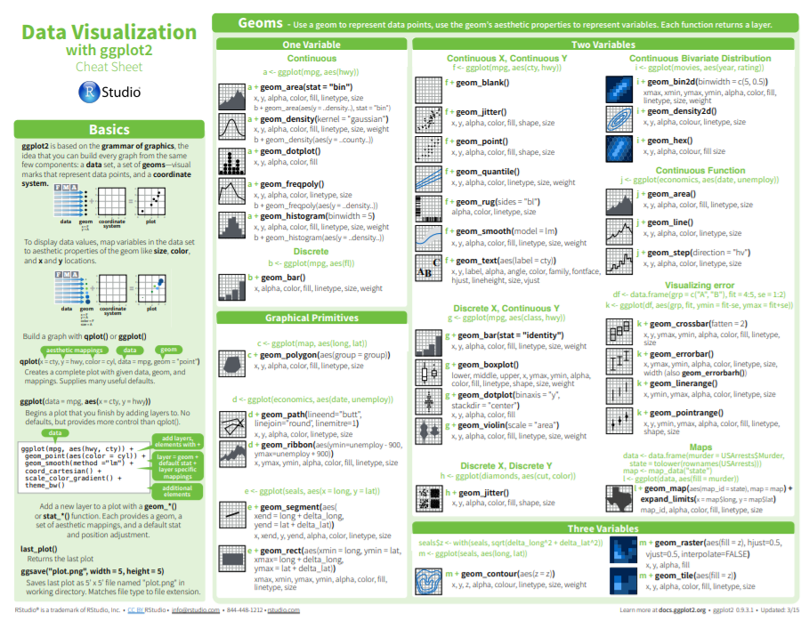

```{r setup, include=FALSE}
knitr::opts_chunk$set(echo = TRUE)
```

# Motivation  

Health policy in the Staes is complicated, and several forms of healthcare 
coverage existed in the United States of America, including both federal goverment-led 
healthcare policy, and private insurance company. Before making any inference about 
the relationship between health condition and health policy, it is important for us to 
have a general idea about healthcare economics in the States. Thus, We are interested in 
getting sense of the health expenditure, including healthcare coverage and 
healthcare spending, across States.  More specifically,
the quesiton are   

1. Is there a relationship between healthcare coverage and healthcare spending in the United States?   
2. How does the spending distribution change across geographic regions in the Unied States?  
3. Does the relationship between healthcare coverage and healthcare spending in the United States change from 2013 to 2014?  
 
# Data Source   

```{r out.width = "95%", echo = FALSE, out.width='90%'}
knitr::include_graphics("https://aspe.hhs.gov/system/files/images-reports-basic/70441/fig1.jpg")
```
[Image source from US Department of Health and Human Services](https://aspe.hhs.gov/basic-report/overview-uninsured-united-states-summary-2011-current-population-survey)

## Healthcare data

We will be using the data from the [Henry J Kaiser Family Foundation (KFF)](https://www.kff.org). 

* [Health Insurance Coverage of the Total Population](https://www.kff.org/other/state-indicator/total-population/) - Includes years 2013-2016
* [Health Care Expenditures by State of Residence (in millions)](https://www.kff.org/other/state-indicator/health-care-expenditures-by-state-of-residence-in-millions/) - Includes years 1991-2014
 
We have downloaded, re-named and saved these files in the 
GitHub repository under the `data/KFF/` directory. 

Now, before we dig into the data analysis, we need to introduce 
a set of R packages that we will use to analyze the data. 


# Data Import 
 
## Introduction to "Tidy data"

The [tidyverse](https://www.tidyverse.org) is _"an opinionated 
collection of R packages designed for data science. All packages 
share an underlying philosophy and common APIs."_ 

Another way of putting it is that it's a set of packages 
that are useful specifically for data manipulation, 
exploration and visualization with a common philosphy. 

#### What is this common philosphy? 

The common philosphy is called _"tidy"_ data. It is 
a standard way of mapping the meaning of a dataset
to its structure.

In _tidy_ data:

* Each variable forms a column.
* Each observation forms a row.
* Each type of observational unit forms a table.

```{r out.width = "95%", echo = FALSE}
knitr::include_graphics("http://r4ds.had.co.nz/images/tidy-1.png")
```

Below, we are interested in transformating the table on 
the right to the the table on the left, which is 
considered "tidy". 

```{r out.width = "95%", echo = FALSE}
knitr::include_graphics("http://r4ds.had.co.nz/images/tidy-9.png")
```

Working with tidy data is useful because it creates a structured way of
organizing data values within a data set. This makes the data analysis 
process more efficient and simplifies the development of data analysis tools
that work together. In this way, you can focus on the problem you are
investigating, rather than the uninteresting logistics of data.  

### 1. What is in the `tidyverse`? 

We can install and load the set of R packages using 
`install.packages("tidyverse")` function. 

When we load the tidyverse package using `library(tidyverse)`, 
there are six core R packages that load:

* [readr](http://readr.tidyverse.org), for data import.
* [tidyr](http://tidyr.tidyverse.org), for data tidying.
* [dplyr](http://dplyr.tidyverse.org), for data wrangling.
* [ggplot2](http://ggplot2.tidyverse.org), for data visualisation.
* [purrr](http://purrr.tidyverse.org), for functional programming.
* [tibble](http://tibble.tidyverse.org), for tibbles, a modern re-imagining of data frames.

Here, we load in the tidyverse. 
```{r, message=FALSE}
library(tidyverse)
```

These packages are highlighted in bold here: 

```{r out.width = "95%", echo = FALSE}
knitr::include_graphics("https://rviews.rstudio.com/post/2017-06-09-What-is-the-tidyverse_files/tidyverse1.png")
```

Because these packages all share the "tidy" philosphy, 
the data analysis workflow is easier as you move from 
package to package. 

Here, we will focus on the `readr`,
`tidyr` and `dplyr` R packages to import data, 
to transform data to the "tidy" format, 
and to wrangle data. 

Next, we will give a brief description of the 
features in each of these packages. 

There are several base R functions that allow you 
read in data into R, which you may be familiar 
with such as `read.table()`, `read.csv()`, 
and `read.delim()`. Instead of using these, 
we will use the functions in the 
[readr](https://readr.tidyverse.org/articles/readr.html)
R package. The main reasons for this are 

1. Compared to equivalent base R functions, the 
functions in `readr` are around 10x faser. 
2. You can specify the column types (e.g 
character, integer, double, logical, date, 
time, etc)
3. All parsing problems are recordered in 
a data frame. 

## Read data using the `readr` R package  

```{r, message=FALSE}
library(readr)
```

The main functions in `readr` are: 

`readr` functions | Description |
--- | ---------------------------------------------------------------------------------------- |
`read_delim()` | reads in a flat file data with a given character to separate fields |
`read_csv()` | reads in a CSV file |
`read_tsv()` | reads in a file with values separated by tabs |
`read_lines()` | reads only a certain number of lines from the file |
`read_file()` | reads a complete file into a string |
`write_csv()` | writes data frame to CSV | 

A useful cheatsheet for the functions in the
`readr` package can be found on RStudio's website: 


### 1. Read in data 

#### Read in health  healthcare coverage data
Let's try reading in some data. We will begin by
reading in the `healthcare-coverage.csv` data. 

If we want to see what the header of the file looks like, 
we can use the `read_lines()` function to peak at the 
first few lines. 

```{r warning=FALSE,message=FALSE}
read_lines(file = "./data/KFF/healthcare-coverage.csv", n_max = 10)
```

It looks like the first two lines are descriptive 
and are not useful. We will tell R to skip reading 
these in using the `skip` argument in 
`read_csv()`. The third line looks like it contains the
column names and starting on the fourth line is
where the data starts. 

```{r, message=FALSE}
coverage <- read_csv("./data/KFF/healthcare-coverage.csv", 
                     skip = 2, col_names = TRUE)
head(coverage)
tail(coverage)
```

It looks like we now have the right header, but
there are a bunch of NAs in the end of the data 
frame because most of it isn't useful data. 

Let's take a closer look at the last 30 lines
```{r warning=FALSE,message=FALSE}
tail(coverage, n=30)
```

It looks like there is a line with a string 
`Notes` in it and everything below that line
should not be read in. We can use the `n_max` 
argument here.

```{r, message=FALSE}
coverage <- read_csv("./data/KFF/healthcare-coverage.csv", 
                     skip = 2, col_names = TRUE)
coverage <- read_csv("./data/KFF/healthcare-coverage.csv", 
                     skip = 2, col_names = TRUE,
                     n_max  = which(coverage$Location == "Notes")-1)
tail(coverage)
```

That's better! 

#### Read in healthcare spending data

Now because we are also going to want to 
use in `healthcare-spending.csv`, let's 
read it in now. 

```{r, message=FALSE}
spending <- read_csv("./data/KFF/healthcare-spending.csv", 
                     skip = 2, col_names = TRUE)
spending <- read_csv("./data/KFF/healthcare-spending.csv", 
                     skip = 2, col_names = TRUE,
                     n_max  = which(spending$Location == "Notes")-1)
tail(spending)
```


### 2. Take a `glimpse()` at your data

One last thing in this section. 
One way to look at our data would be to use 
`head()` or `tail()`, as we just saw. 
Another one you might have heard of is the
`str()` function. One you might not have 
heard of is the `glimpse()` function. It's
used for a special type of object in R called 
a `tibble`. Let's read the help file to learn
more. 

```{r, eval=FALSE}
?tibble::tibble
```

It's kind of like `print()` where it shows you 
columns running down the page. Let's try it out. 
If we look at our data, say the `coverage` 
data frame, we see that it is not _"tidy"_: 
```{r warning=FALSE,message=FALSE}
glimpse(coverage)
```

## Read the State information using the `datasets` R package 

Since our goal is to get sense of the health expenditure, including healthcare coverage and 
healthcare spending, **across States**, 
it would be nice add some information about each state. 
Namely, the state abbreviation and state region 
(i.e. north, south, etc). 

For this we use the 
[state](https://stat.ethz.ch/R-manual/R-devel/library/datasets/html/state.html)
dataset in the `datasets` R package. 

Before we begin, let's look at what states are there: 

```{r}
unique(coverage$Location)
```

We see there are more than 50 states because 
"United States" and "District of Columbia" 
are both included. 

Let's look what states are inside the `state` dataset. 
```{r}
library(datasets)
data(state)
unique(state.name)
```

Ah, ok. So let's start by dealing with
DC as a special case. 

```{r}
state.abb <- c(state.abb, "DC")
state.region <- as.factor(c(as.character(state.region), "South"))
state.name <- c(state.name, "District of Columbia")
```

We will deal with the "United States" in 
the next section. 

# Data Wrangling 

## What is "Tidy Data"?  

#### Glance at "Tidy Data"
A subset of the data analysis process can be thought
about in the following way:

```{r out.width = "95%", echo = FALSE}
knitr::include_graphics("http://r4ds.had.co.nz/diagrams/data-science.png")
```

where each of these steps need their own 
tools and software to complete. 

After we import the data into R, if we are 
going to take advantage of the _"tidyverse"_, 
this means we need to _transform_ the data 
into a form that is _"tidy"_. If you recall, 
in _tidy_ data:

* Each variable forms a column.
* Each observation forms a row.
* Each type of observational unit forms a table.

For example, consider the following dataset: 


Here:  

* each row represents one company (row names are companies)
* each column represent one time point
* the stock prices are defined for each row/column pair

Alternatively, a data set can be structured in the following way:

* each row represents one time point (but no row names)
* the first column defines the time variable and the last three columns contain the stock prices for three companies 


In both cases, the data is the same, but the structure is 
different. This can be  _frustrating_ to deal with as an 
analyst because the meaning of the values (rows and columns)
in the two data sets are different. Providing a standardized 
way of organizing values within a data set would alleviate 
a major portion of this frustration.  

For motivation, a _tidy_ version of the stock data we 
looked at above looks like this: (we'll learn how the
functions work in just a moment)


In this "tidy" data set, we have three columns representing 
three variables (time, company name and stock price). 
Every row represents contains one stock price from a 
particular time and for a specific company. 

If we consider our `coverage` dataframe, we see it 
is also not in a tidy format. Each row contains information
about the coverage level by `Location` across years and 
types of coverage. 

```{r}
coverage[1:5, 1:5]
```

Now, let's use the `tidyr` R package to transform
our data into a _tidy_ format. 

## The `tidyr` R package

### 1. What is the `tidyr` R package ?

[`tidyr`](https://cran.r-project.org/web/packages/tidyr/vignettes/tidy-data.html)
is an R package that transforms data sets to a tidy format. 

This package is installed and loaded when you load 
the `tidyverse` using `library(tidyverse)`. However, 
you can also just load the library by itself. 

```{r, message=FALSE}
library(tidyr)
```

The main functions in `tidyr` are: 

`tidyr` functions | Description |
--- |  ---------------------------------------------------------------------------------------- |
`gather()` | takes multiple columns, and gathers them into key-value pairs, making "wide" data longer |
`separate()` | turns a single character column into multiple columns, making "long" data wider |
`spread()` | spread rows into multiple columns, transforming "long" data into "wide" format | 

We'll explore what it means to go between a "wide" and "long" 
data format using `gather()` , `separate()`, and `spread()`. 

A [`tidyr` cheatsheet](https://www.rstudio.com/wp-content/uploads/2015/02/data-wrangling-cheatsheet.pdf)
for the functions in the `tidyr` package can be 
found on RStudio's website: 

### 2. Convert data from wide format to long format using `gather()` 

Let's start by looking at the `gather()` help file

```{r, eval=FALSE}
?gather
```

This function gathers multiple columns and collapses them into new 
*key-value* pairs. This transform data from _wide_ format into 
a _long_  format. 

* The `key` is the name of the _new_ column that you are creating which 
contains the values of the column headings that you are gathering 
* The `value` is the name of the _new_ column that will contain the values
themselves
* The third argument defines the columns to gather

For example, here we create a column titled 
`year_type` and `coverage`. We also want to keep 
the `Location` column as it is because it also contains
observational level data.

```{r}
coverage <- gather(coverage, "year_type", "tot_coverage", -Location)
coverage
```

Now we see each row contains one observation. 
Namely, a `Location`, a `year_type` and `coverage`. 
It would be nice to separate out the information 
in the `year_type` column into two columns. We can 
implement same techniques to the healthcare spending 
dataset. 

#### Convert healthcare spending data to a long format (tidy format)

Let's do the same for the `spending` data. In this 
case I will use `year` and `spending` for
the `key` and `value`. We also want to keep `Location`
like before. 

```{r}
spending <- gather(spending, "year", "tot_spending", -Location)
spending
```


We will 
explore how to do that in the Data Wrangling section
below. For now let's learn more about the `tidyr` 
package. 

### 3. Convert data from long format to wide format using `spread()` 

In contrast to *gathering* multiple columns into key-value pairs, we can 
*spread* a key-value pair across multiple columns.  

The function `spread()` does just that. It transforms data from a _long_
format into a _wide_ format. 

* The `key` is the name of the column in your data set that 
contains the values of the column headings that you are spreading across 
multiple columns
* The `value` is the name of the column that contains the values for the 
multiple columns


```{r}
spread(coverage, year_type, tot_coverage)
```


In the real world, analyzing data rarely involves 
data that can be easily imported and ready for 
analysis. According to Wikipedia:

> Data munging or data wrangling is loosely the process 
of manually converting or mapping data from one "raw" 
form into another format that allows for more convenient 
consumption of the data with the help of semi-automated 
tools.

As you will see in class, one of the most 
time-consuming aspects of the data analysis 
process is "data wrangling". This is also 
is a trendy term for 
_cleaning up a messy data set_. 

R provides incredibly powerful and flexible language 
for data wrangling. However, the syntax is somewhat 
hard to get used to. We will therefore introducing 
a package that makes the syntax much more like 
the English language. This package is `dplyr`. 

## The `dplyr` R package

### 1. What is the `dplyr` R package ? 

[`dplyr`](http://cran.rstudio.com/web/packages/dplyr/vignettes/introduction.html) 
is a powerful R-package to transform and summarize 
tabular data with rows and columns. 

The package contains a set of functions 
(or "verbs") to perform common data manipulation
operations such as filtering for rows, selecting 
specific columns, re-ordering rows, adding new 
columns and summarizing data. 

In addition, `dplyr` contains a useful function to
perform another common task which is the is the 
"split-apply-combine" concept.  We will discuss 
that in a little bit. 

### 2. Compare `dplyr` R package compare with base functions R 

If you are familiar with R, you are probably familiar 
with base R functions such as `split()`, `subset()`, 
`apply()`, `sapply()`, `lapply()`, `tapply()` and 
`aggregate()`. Compared to base functions in R, the 
functions in `dplyr` are easier to work with, are 
more consistent in the syntax and are targeted for 
data analysis around data frames instead of just vectors. 

The important `dplyr` verbs to remember are: 


`dplyr` verbs | Description |
--- | ------------------------------------------------------------------------------------ |
`select()` | select columns  |
`filter()` | filter rows |
`arrange()` | re-order or arrange rows |
`mutate()` | create new columns |
`summarize()` | summarize values |
`group_by()` | allows for group operations in the "split-apply-combine" concept |


### 3. Pipe operator: %>%

Before we go any futher, let's introduce the 
pipe operator: `%>%`. In our `stocks` example,
we briefly saw this symbol. It is called the
pipe operator. `dplyr` imports
this operator from another package 
(`magrittr`)
[see help file here](http://cran.r-project.org/web/packages/magrittr/vignettes/magrittr.html). 
This operator allows you to pipe the output 
from one function to the input of another
function. Instead of nesting functions 
(reading from the inside to the 
outside), the idea of of piping is to 
read the functions from left to right. 

Now in `stocks` example, we pipe the `stocks`
data frame to the function that will 
gather multiple columns into key-value pairs. 


####  `dplyr` verbs in action: `separate()`, `unite()`, ...

First, let's separate the `year_type` column 
in the `coverage` dataset to two columns:
`year` and health coverage `type`. 

To do this, we will use the `separate()` 
function in the `tidyr` package. 

**Note**: 

* `separate()` = separate one column into multiple columns
* `unite()` = unite multiple columns into one

#### Learn `separate()` and `unite()` in the `spending` dataset

```{r}
coverage %>% 
  separate(year_type, sep="__", 
           into=c("year", "type"))
```

We see that we now have two columns, except 
the `year` column was converted to a character. 
If we look at the help file `?separate`, we see
we can use the `convert=TRUE` argument to 
convert the character to an integer. 

```{r}
coverage <- 
  coverage %>% 
  separate(year_type, sep="__", 
           into=c("year", "type"), 
           convert = TRUE)
coverage
```

Next, we see that the `tot_coverage` column is 
also a character. Gah! 

Let's fix that. We can use the `mutate_at()` 
function to do this. We are asking R to take
`tot_coverage` column and convert it to an
integer and then replace the old column with 
the new converted column 

```{r}
coverage <- 
  coverage %>% 
  mutate_at("tot_coverage", as.integer)

# Add the abbreviation of States
coverage$abb <- state.abb[match(coverage$Location, state.name)]
coverage$region <- state.region[match(coverage$Location, state.name)]

coverage
```

The `coverage` data looks good now. We see 
that there are different `year`s and different 
`types` of healthcare coverage. 

Also, you may want to link the coverage data with our location information. 
```{r}
# Add the abbreviation of States
coverage$abb <- state.abb[match(coverage$Location, state.name)]
coverage$region <- state.region[match(coverage$Location, state.name)]

coverage
```

#### (*) What is the range of years and types of healthcare in the `coverage` dataset?   

```{r}
table(coverage$type, coverage$year)
```


#### Implement  `separate()` and `unite()` in the `spending` dataset      

Next, we will look at the `spending` data. 
We see the `year` column has information that 
we do not want. We only care about the year. 

```{r}
spending
```

Let's use the `separate()` function with `convert=TRUE` 
to separate the `year` column into columns. Then, we 
introduce another `dplyr` action verb: `select()`. 

The two most basic functions are `select()` and 
`filter()` which selects columns and filters 
rows, respectively. 

### 4. Select columns using `select()`

In the `separate()` function, we create two
new columns called `year` and `name`. Then, 
we ask to return all the columns, except 
`name`. To select all the columns *except* a 
specific column, use the "-" (subtraction) operator 
(also known as negative indexing). 

```{r warning=FALSE,message=FALSE}
spending <- 
  spending %>% 
  separate(year, sep="__", into=c("year", "name"), convert = TRUE) %>% 
  select(-name)
spending
```

The function `select()` is much more 
powerful though. To select a range 
of columns by name, use the ":" (colon) operator

```{r warning=FALSE,message=FALSE}
coverage %>% 
  select(year:type)
```

To select all columns that start with the 
character string "t", use the function `starts_with()`

```{r warning=FALSE,message=FALSE}
coverage %>% 
  select(starts_with("t"))
```

Some additional options to select columns based 
on a specific criteria include

1. `ends_with()` = Select columns that end with 
a character string
2. `contains()` = Select columns that contain 
a character string
3. `matches()` = Select columns that match a 
regular expression
4. `one_of()` = Select columns names that are 
from a group of names


### 5. Select rows using `filter()`

Let's say we want to know how many peopled 
had health insurance coverage in Maryland? 

First, we can filter the rows for years in 2007. 

```{r warning=FALSE,message=FALSE}
coverage %>% 
  filter(Location == "Maryland")
```

**Note**: you can use the boolean operators 
(e.g. `>`, `<`, `>=`, `<=`, `!=`, `%in%`) 
to create logical tests.

For example, if we wanted only years 
after 2014, we can add a second criteria: 

```{r warning=FALSE,message=FALSE}
coverage %>% 
  filter(Location == "Maryland", 
         year > 2014)
```

#### (*) Has the number of uninsured has increased or decreased in Maryland between 2013 and 2016?  

```{r warning=FALSE,message=FALSE}
coverage %>% 
  filter(Location == "Maryland", 
         type == "Uninsured")
```

What happened between 2013 and 2014?   

[Probably this is due to ACA](https://en.wikipedia.org/wiki/Patient_Protection_and_Affordable_Care_Act)

### 6. Arrange or re-order rows using `arrange()` 

Now, let's say we want to see which states has the To arrange (or re-order) rows by a particular 
column such as the population, list the name of 
the column you want to arrange the rows by

```{r warning=FALSE,message=FALSE}
coverage %>% 
    arrange(tot_coverage)
```


#### (*) In 2016, what were the top three states with the largest `Employer` type of healthcare coverage? 

**Hint**: use the `desc()` function inside of
`arrange()` to order rows in a descending order. 

```{r warning=FALSE,message=FALSE}
coverage %>% 
  filter(Location != "United States", year == 2016, type == "Employer") %>% 
  arrange(desc(tot_coverage)) %>% 
  head(n=3)
```


### 7. Join two datasets using `join()`  


Here, we're gioing to demonstrate how to 
join two datasets using series of `join()` function, including 
`left_join()`, `right_join()`, `inner_join()`, ...  

Up until now, we have been working with three
datasets `coverage` and `spending` separtely. 
Next, we will combine these together.  

If we want to combine, say, `coverage` and `spending` 
together, we have to decide a few things. Both 
share a `Location` column and a `year` column. 
However, the range of `years` is different between
datasets. 

```{r}
table(coverage$year)
table(spending$year)
```

Do we want a dataset with all the years available
or only a portion of it? Because there is spending
information from 1991-2014, 
and coverage information from 2013-2016.

`dplyr` has a list of `join` functions that are 
useful to combine datasets. To read more about them, 
Jenny Bryan has created a nice 
[cheatsheet](http://stat545.com/bit001_dplyr-cheatsheet.html). 

If we look at the help file
```{r}
?dplyr::join
```

We see there are several options for us to pick from. 
Let's try one out. We'll start with `left_join()`
and see what that does. 

```{r}
hc <- left_join(coverage, spending, by = c("Location", "year"))
head(hc)
tail(hc)
```

What did it do? We see that the new `hc` dataset
includes all the years from 2013-2016 (as that 
is the range of years in `coverage`), but because
the `spending` dataset only goes to 2014, the 
`tot_spending` is reported as NA for years 2015 and
2016. 

#### What about a `right_join()`? 
```{r}
hc <- right_join(coverage, spending, by = c("Location", "year"))
head(hc)
tail(hc)
```

Here, we see every row in the spending dataset is 
there, but with NAs for the years that there was no 
coverage data. 

There is also a `full_join()` and 
`inner_join()`. If we want the intersection of 
`years` from `coverage` and `spending` (meaning only 
2013 and 2014), we should use `inner_join()`. 

```{r}
hc <- inner_join(coverage, spending, by = c("Location", "year"))
head(hc)
tail(hc)
```

Yes, that's what we want! 

Next, if we are only interested in looking at US 
states, we can remove the rows corresponding to 
the `Location == "United States"`

```{r}
hc <- hc %>% 
  filter(Location != "United States")
```

Another problem is that inside our `hc` 
dataset, we have seen there are 
multiple `types` of healthcare coverage

```{r}
table(hc$type)
```

The `total` type is not really a formal type of
healthcare coverage. It really represents just 
the total number of people in the state. This is 
useful information and we can include it as a 
column called `tot_pop`. How can we do this? 

Well, one way would be to use the `join` functions
again in `dplyr`. 

```{r}
pop <- hc %>% 
  filter(type == "Total") %>% 
  select(Location, year, tot_coverage)
pop

hc <- hc %>% 
  filter(type != "Total") %>% 
  left_join(pop, by = c("Location", "year")) %>% 
  rename(tot_coverage = tot_coverage.x, tot_pop = tot_coverage.y)
hc
```

We can check to make sure that the `total`
is no longer listed as a `type` of healthcare
coverage. 

```{r}
table(hc$type)
```

We are now ready to try answering our first 
question that we asked: 

> 1. Is there a relationship between healthcare coverage and healthcare spending in the United States?

Let's pick out the `type==Employer` 
and `year==2013`. 

```{r}
hc.employer.2013 <- hc %>%
  filter(type == "Employer", year == "2013")
plot(hc.employer.2013$tot_spending, 
     hc.employer.2013$tot_coverage, log = "xy", 
     xlab = "spending", ylab = "coverage")
```

We see there is a strong relationship. However, 
we also see that healthcare coverage and spending 
is also strongly related to population size 

```{r, fig.width=10, fig.height=4}
par(mfrow=c(1,2))
plot(hc.employer.2013$tot_pop, 
     hc.employer.2013$tot_coverage, log = "xy", 
     xlab = "population size", ylab = "coverage")
plot(hc.employer.2013$tot_pop, 
     hc.employer.2013$tot_spending, log = "xy", 
     xlab = "population size", ylab = "spending")
```

This means we need to take into account the 
population size of each state when we are 
comparing the heathcare coverage and spending. 

### 8. Add columns using `mutate()`

Instead of the absolute number of people who 
are covered (`tot_coverage`), we will calculate
the proportion of people who are coverage in 
each state, year and type. 

For this, we will use the `mutate()` function 
in `dplyr`. 

```{r}
hc <- hc %>% 
    mutate(prop_coverage = tot_coverage/tot_pop) 
hc
```

We need to add another column to our dataset.
We will add the spending per capita (or spending 
per person) in dollars and name this column 
`spending_capita`. 

#### How we will do this?

The `tot_spending` column is reported 
in millions (1e6). Therefore, to calculate 
`spending_capita` we will need to adjust for this
scaling factor to report it on the original scale
(just dollars) and then divide by `tot_pop`.

```{r}
hc <- hc %>% 
    mutate(spending_capita = (tot_spending*1e6) / tot_pop) 
hc %>% select(prop_coverage, spending_capita)
```

Now we are ready to go back to our first question

> 1. Is there a relationship between healthcare coverage and healthcare spending in the United States? 

```{r}
hc.employer.2013 <- hc %>%
  filter(type == "Employer", year == "2013")
plot(hc.employer.2013$spending_capita, 
     hc.employer.2013$prop_coverage, log = "xy", 
     xlab = "spending per capita", 
     ylab = "proportion of Employer coverage")
```

Yes, it looks like there is a relationship for 
`Employer` healthcare coverage in 2013. 

We will continue to explore the other
types of coverages later on. For now, we 
get back to to learning more action verbs 
in `dplyr`. 

Our second question that we were interested 
in was: 

> 2. Which US states spend the most and which spend the least on healthcare? How does the spending distribution change across geographic regions in the United States?

To answer these questions, we need to learn how 
to calculate summary statistics in our data. 

### 9.  Create summaries of columns using `summarise()`

The `summarise()` function in `dplyr` 
will create summary statistics for a given 
column in the data frame 
such as finding the max, min, average. 
For example, to compute the average spending 
per capita, we can apply the `mean()` function 
to the column `spending_captia` and call the 
summary value `avg_spending_capita`. 

```{r}
hc %>% 
  summarise(avg_spending_capita = mean(spending_capita))
```

There are many other summary statistics you 
could consider such `sd()`, `min()`, `median()`, 
`mean()`, `sum()`, `n()` (returns the length of vector), 
`first()` (returns first value in vector), 
`last()` (returns last value in vector) and 
`n_distinct()` (number of distinct values in vector). 

Also note, this is the average across all states,
and all years. This is not very informative. 

If you recall, our question asked about 
_which states_ spent the most, so we want 
an average spending per capita for each state. 

For this, we need to introduc another function in 
`dplyr` called `group_by()`. 

### 10. Group operations using `group_by()`

The `group_by()` verb is and incredibly powerful
function in `dplyr`. As we mentioned before
it's related to concept of "split-apply-combine". 

In our example above, we want to split the data 
frame by some variable (e.g. `Location`), 
apply a function to the individual 
data frames (`mean`) and then combine the output
back into a summary data frame. 

Let's see how that would look

```{r}
hc %>% 
  group_by(Location) %>%
  summarise(avg_spending_capita = mean(spending_capita))
```

That's better. Here we are averaging across the
years 2013 and 2014. 

#### (*) What are the top 3 states that have the largestaverage spending per capita? What about the top 3 states with the smallest average spending per capita? 

```{r}
# smallest 
hc %>% 
  group_by(Location) %>%
  summarise(avg_spending_capita = mean(spending_capita)) %>% 
  arrange(avg_spending_capita) %>% 
  head(n=3)

# largest 
hc %>% 
  group_by(Location) %>%
  summarise(avg_spending_capita = mean(spending_capita)) %>% 
  arrange(desc(avg_spending_capita)) %>% 
  head(n=3)
```

#### (*) How does the spending distribution change across geographic regions in the United States? 

**Hint**: Calculate the mean and standard deviation of
spending per capita for each geographic region in the US. 

```{r}
hc %>% 
  group_by(region) %>%
  summarise(avg_spending_capita = mean(spending_capita), 
            sd_spending_capita = sd(spending_capita))
```

Another way to visualize distributions is to use boxplots. 

Create four boxplots represening the spending per capita 
distribution for each of the four regions using 
the `boxplot()` function in R.

```{r}
boxplot(hc$spending_capita ~ hc$region)
```

Now that we have our data in a `tidy` format, next, 
we will learn about how to do this using the 
`ggplot2` R package in the `tidyverse`. 

# Data Visualization  

As you have already seen, there are many functions available
in base R that can create plots (e.g. `plot()`, `boxplot()`). 
Others include: `hist()`, `qqplot()`, etc. These 
functions are great because they come with a basic installation 
of R and can be quite powerful when you need a quick visualization 
of something when you are exploring data. 

We are choosing to introduce `ggplot2` because, in our 
opinion, it's one of the simplest ways for beginners to 
create relatively complicated plots that are intuitive 
and aesthically pleasing. 

## The `ggplot2` R package

The reasons [`ggplot2`](http://ggplot2.tidyverse.org) 
is generally intuitive for beginners is the use of 
[grammar of graphics](http://vita.had.co.nz/papers/layered-grammar.html) 
or the `gg` in `ggplot2`. The idea is that you can construct
many sentences by learning just a few nouns, adjectives,
and verbs. There are specific "words" that we will need to 
learn and once we do, you will be able to create 
(or "write") hundreds of different plots. 

The critical part to making graphics using `ggplot2` is the 
data needs to be in a _tidy_ format. Given that we have 
just spend the last two lectures learning about how to 
work with _tidy_ data, we are primed to take 
advantage of all that `ggplot2` has to offer! 

We will show how it's easy to pipe _tidy_ data
(output) as input to other functions that creates
plots. This all works because we are working 
within the _tidyverse_. 

#### `ggplot2` cheatsheet

The [cheatsheet](https://www.rstudio.com/wp-content/uploads/2015/03/ggplot2-cheatsheet.pdf) 
looks like the following:
```{r, echo=FALSE}


```


### 1. What is the `ggplot()` function? 

As explained by Hadley Wickham: 

> the grammar tells us that a statistical graphic is a mapping from data to aesthetic attributes (colour, shape, size) of geometric objects (points, lines, bars). The plot may also contain statistical transformations of the data and is drawn on a specific coordinates system.

#### `ggplot2` Terminology 
* **ggplot** - the main function where you specify the data set and variables to plot (this is where we define the `x` and
`y` variable names)
* **geoms** - geometric objects
    * e.g. `geom_point()`, `geom_bar()`, `geom_line()`, `geom_histogram()`
* **aes** - aesthetics
    * shape, transparency, color, fill, linetype
* **scales** - define how your data will be plotted
    * continuous, discrete, log, etc

There are three ways to initialize a `ggplot()` object. 

An empty ggplot object
```{r}
p <- ggplot()         
```

A ggplot object associated with a dataset
```{r}
p <- hc %>% 
      filter(year==2014) %>% 
      ggplot()
```
or a ggplot object with a dataset and `x` and `y` defined

```{r}
p <- hc %>% 
      filter(year==2014) %>% 
      ggplot(aes(x = spending_capita, y = prop_coverage))
```

```{r, eval = FALSE}
p
```

### 2. Create scatter plots using `geom_point()` 

The function `aes()` is an aesthetic mapping 
function inside the `ggplot()` object. We 
use this function to specify plot attributes 
(e.g. `x` and `y` variable names) that 
will not change as we add more layers.  

Anything that goes in the `ggplot()` object becomes
a global setting. From there, we use the `geom`
objects to add more layers to the base `ggplot()` 
object. These will define what we are interested in 
illustrating using the data.  

If you recall, our first question that we were
interested in was 

> 1. Is there a relationship between healthcare coverage and healthcare spending in the United States?

Before, we were using base R to create something
like this: 

```{r}
hc.employer.2013 <- hc %>% 
  filter(type == "Employer", year == "2013")

plot(hc.employer.2013$spending_capita, 
     hc.employer.2013$prop_coverage, 
     xlab = "spending per capita", 
     ylab = "coverage proportion")
```

Let's  re-create this plot with `ggplot2` 
using the `geom_point()` geometry. 

```{r}
p <- hc %>%
  filter(type == "Employer", year == "2013") %>% 
  ggplot(aes(x = spending_capita, y = prop_coverage)) 
p + geom_point() + 
  xlab("spending per capita") + 
  ylab("coverage proportion")
```

We used the `xlab()` and `ylab()` functions
in `ggplot2` to specify the x-axis and y-axis
labels. 

**Note**, we do not have to assign (`<-`) the plot 
to anything: 

```{r}
hc %>%
  filter(type == "Employer", year == "2013") %>% 
  ggplot(aes(x = spending_capita, y = prop_coverage)) + 
  geom_point() + 
  xlab("spending per capita") + 
  ylab("coverage proportion")
```


It's also simple to fit a linear regression model 
and plot it on top of scatter plot using the 
`geom_smooth()` (or `stat_smooth()`) functions. 

```{r}
hc %>%
  filter(type == "Employer", year == "2013") %>% 
  ggplot(aes(x = spending_capita, y = prop_coverage)) + 
  geom_point() + 
  xlab("spending per capita") + 
  ylab("coverage proportion") + 
  geom_smooth(method = "lm", col = "red")
```

The standard error bounds are computed and included 
in the plot. 


It would be nice to know which state is represented
by which state. For this, we will introduce another 
_geom_ called `geom_text()`. 

### 3. Add layers of text using `geom_text()`

In our dataset, we have information about the 
abbreviation for each state. We could add the 
abbreviations for each state next to the point on 
the plot to assess which states have a higher or
lower coverage for a given amount of money they 
spend per capita. 

```{r}
hc %>% 
  filter(type == "Employer", year == "2013") %>% 
  ggplot(aes(x = spending_capita, y = prop_coverage)) + 
  geom_point() + 
  xlab("spending per capita") + 
  ylab("coverage proportion") + 
  geom_smooth(method = "lm", col = "red") + 
  geom_text(aes(label=abb))
```

That is cool, but it would be even better if we 
could _nudge_ the text over a bit. Let's look at 
the help file for `geom_text()`: 

```{r, eval=FALSE}
?ggplot2::geom_text
```

We see there is an argument called 
`nudge_x` and `nudge_y`. We can use these 
to _nudge_ the text over a bit so the 
text is not directly on top of the points. 

```{r}
hc %>% 
  filter(type == "Employer", year == "2013") %>% 
  ggplot(aes(x = spending_capita, y = prop_coverage)) + 
  geom_point() + 
  xlab("spending per capita") + 
  ylab("coverage proportion") + 
  geom_smooth(method = "lm", col = "red") + 
  geom_text(aes(label=abb), nudge_x = 150)
```

#### (*) Color each point (or state) by what region they are from.  

```{r}
## add your code here

hc %>% 
  filter(type == "Employer", year == "2013") %>% 
  ggplot(aes(x = spending_capita, y = prop_coverage, 
             color = region)) + 
  geom_point() + 
  xlab("spending per capita") + 
  ylab("coverage proportion") + 
  geom_smooth(method = "lm", col = "red") + 
  geom_text(aes(label=abb), nudge_x = 150)
```


### 4. Facet across a variable using `facet_wrap`

Ok, getting back to our original question: 

> 1. Is there a relationship between healthcare coverage and healthcare spending in the United States? 

We saw there was a positive relationship,
but this was only for one type of healthcare 
coverage (`Employer`) and one year. 
What about the other types? 

For this, we will introduce `facets`. The idea 
of _faceting_ is to stratify the data by some 
variable and make the same plot for each strata. 

For example, if we wanted to _facet_ by the 
`type` variable, we will add a layer to our 
`ggplot()` object using the `facet_grid()` or 
`facet_wrap()` functions. The function expects
the row and column variables to be separated 
by a `~`. 

```{r, fig.width=12, fig.height=8}
hc %>%
  filter(year == "2013") %>% 
  ggplot(aes(x = spending_capita, y = prop_coverage, 
             color = region)) + 
  geom_point() + 
  xlab("spending per capita") + 
  ylab("coverage proportion") + 
  geom_smooth(method = "lm", col = "red") + 
  geom_text(aes(label=abb), nudge_x = 150) + 
  facet_wrap(~type)
```

We see that the proportion of people covered 
have different scales in the y-axis. Let's 
read the help file to see if there is some way 
to not restrict the y-axis to be the same. 
```{r}
?ggplot2::facet_grid
```

Yes, we see there is an argument called 
`scales` that can be `free_y`, (free columns),
`free_x` (free rows), and `free` (both). 
Let's try `free_y` and look at a different
year (`year=="2014"`): 

```{r, fig.width=12, fig.height=6}
hc %>%
  filter(year == "2014") %>% 
  ggplot(aes(x = spending_capita, y = prop_coverage, 
             color = region)) + 
  geom_point() + 
  xlab("spending per capita") + 
  ylab("coverage proportion") + 
  geom_smooth(method = "lm", col = "red") + 
  geom_text(aes(label=abb), nudge_x = 150) + 
  facet_wrap(~type, scales="free_y")
```

Given we know `Other Public` refers to the 
military or Veterans Adminstration, we can see 
states like HI, VA, NV have a larger 
proportion of military or VA `Other Public` 
type coverage. While a state like AK has a 
similar proportion of `Other Public` coverage, 
it has a much larger spending per capita. 

We also see a negative relationship with the 
`Uninsured` type. The more states spend, the
less uninsured people in the state. 

### 5. Create boxplots using `geom_boxplot()`

Next, let's revisit the second question. 

> 2. Which US states spend the most and which spend the least on healthcare? How does the spending distribution change across geographic regions in the United States?

Let's try making a boxplot with `ggplot2`. 
If you recall, the way to do this in base R was: 

```{r}
boxplot(hc$spending_capita ~ hc$region)
```

Now, we introduce the `geom_boxplot()` 
function. Note, we needed to tell `ggplot2`
what needs to be along the x and y axis in
`aes()`. 

```{r}
hc %>% 
  ggplot(aes(x = region, y = spending_capita)) + 
  geom_boxplot()
```

### 6. Facet by two variables using `facet_grid`

> 3. Does the relationship between healthcare coverage and healthcare spending in the United States change from 2013 to 2014?   

Let's try faceting by both `year` and `type`. 
Note that we can facet by rows putting a 
column name before the `~` and facet by 
columns putting a column name after the `~`. 
We are also using `facet_grid()` instead of 
`facet_wrap()`.

```{r, fig.width=12, fig.height=8}
p <- hc %>%
  ggplot(aes(x = spending_capita, y = prop_coverage, 
             color = region)) + 
  geom_point() + 
  xlab("spending per capita") + 
  ylab("coverage proportion") + 
  geom_smooth(method = "lm", col = "red") + 
  geom_text(aes(label=abb), nudge_x = 150) 

p + facet_grid(year~type, scales="free")
p + facet_grid(year~type)
```


# Summary   

The total healthcare expenditure is associated with 
the population. To make a fair comparison, 
we create "healthcare expenditure per capita." 
Further, the exploratory analysis via data visualization showed 
higher speding in healthcare per capita 
is positively associated with higher 
employer coverage proportion and is 
negatively associated with the porportion 
of uninsured population across the States. 


